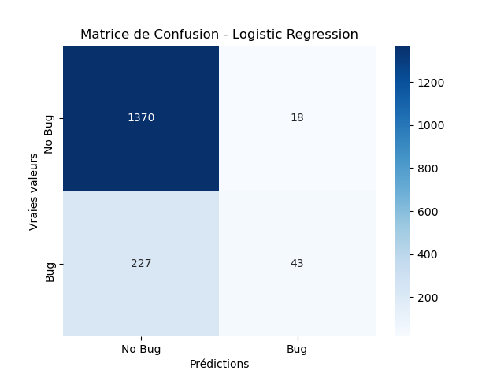
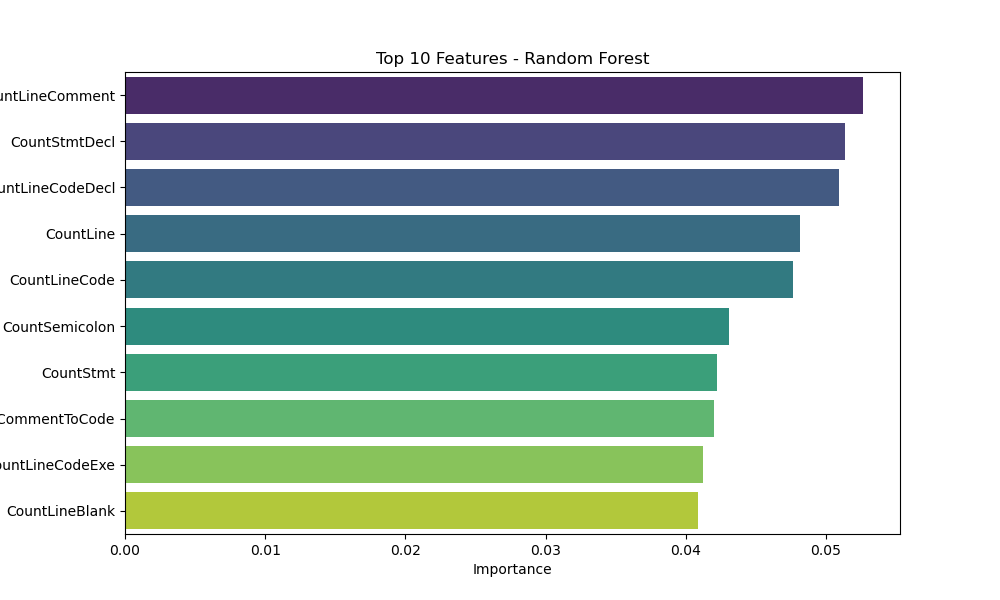
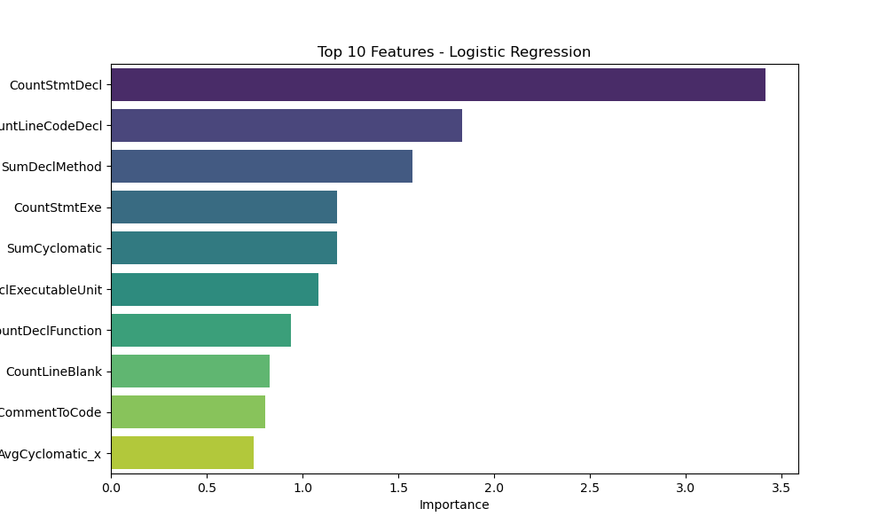

# Model Evaluation Results

## Metrics
| Model               |      AUC |   Precision |   Recall |
|:--------------------|---------:|------------:|---------:|
| Logistic Regression | 0.769349 |    0.682951 | 0.184109 |
| Random Forest       | 0.812364 |    0.638339 | 0.262942 |

## Visualizations
### Matrice de Confusion
|**Random Forest** | **Logistic Regression**|
:-----------------:|:-----------------------:
 | 

### Feature Importances
**Random Forest**
| Feature            |   Importance |
|:-------------------|-------------:|
| CountLineComment   |    0.0526372 |
| CountStmtDecl      |    0.0513405 |
| CountLineCodeDecl  |    0.0509076 |
| CountLine          |    0.0481069 |
| CountLineCode      |    0.0476172 |
| CountSemicolon     |    0.0431088 |
| CountStmt          |    0.0421992 |
| RatioCommentToCode |    0.0420353 |
| CountLineCodeExe   |    0.0412474 |
| CountLineBlank     |    0.0408547 |
---

**Logistic Regression**
| Feature                 |   Importance |
|:------------------------|-------------:|
| CountStmtDecl           |     3.41578  |
| CountLineCodeDecl       |     1.83214  |
| SumDeclMethod           |     1.57315  |
| CountStmtExe            |     1.17868  |
| SumCyclomatic           |     1.17857  |
| CountDeclExecutableUnit |     1.08512  |
| CountDeclFunction       |     0.938474 |
| CountLineBlank          |     0.829669 |
| RatioCommentToCode      |     0.806828 |
| AvgCyclomatic_x         |     0.742937 |

|**Random Forest** | **Logistic Regression**|
:-----------------:|:-----------------------:
 | 
