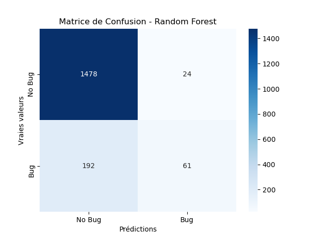
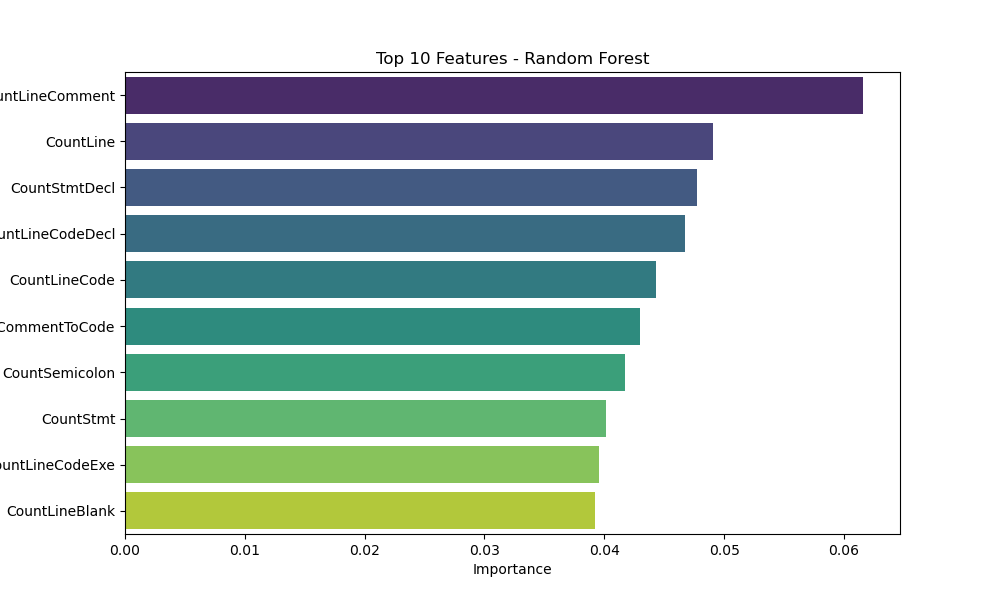
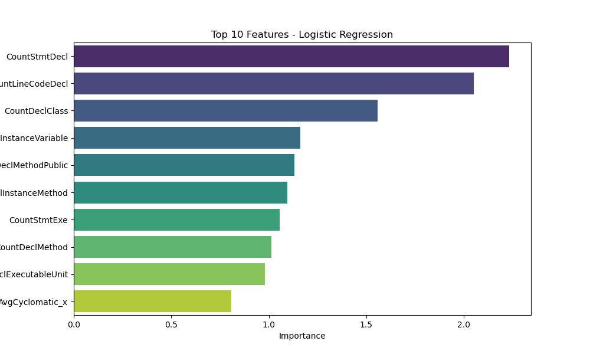

# Model Evaluation Results

## Metrics
| Model               |      AUC |   Precision |   Recall |
|:--------------------|---------:|------------:|---------:|
| Logistic Regression | 0.749745 |    0.706305 | 0.178677 |
| Random Forest       | 0.792316 |    0.665535 | 0.233555 |

## Visualizations
### Matrice de Confusion
|**Random Forest** | **Logistic Regression**|
:-----------------:|:-----------------------:
 | 

### Feature Importances
**Random Forest**
| Feature            |   Importance |
|:-------------------|-------------:|
| CountLineComment   |    0.0615964 |
| CountLine          |    0.0490603 |
| CountStmtDecl      |    0.0477388 |
| CountLineCodeDecl  |    0.046741  |
| CountLineCode      |    0.0443118 |
| RatioCommentToCode |    0.0429413 |
| CountSemicolon     |    0.0417399 |
| CountStmt          |    0.0401643 |
| CountLineCodeExe   |    0.0395764 |
| CountLineBlank     |    0.0391826 |
---

**Logistic Regression**
| Feature                   |   Importance |
|:--------------------------|-------------:|
| CountStmtDecl             |     2.23289  |
| CountLineCodeDecl         |     2.04973  |
| CountDeclClass            |     1.55678  |
| CountDeclInstanceVariable |     1.16184  |
| CountDeclMethodPublic     |     1.13244  |
| CountDeclInstanceMethod   |     1.09435  |
| CountStmtExe              |     1.05531  |
| CountDeclMethod           |     1.01357  |
| CountDeclExecutableUnit   |     0.981268 |
| AvgCyclomatic_x           |     0.807148 |

|**Random Forest** | **Logistic Regression**|
:-----------------:|:-----------------------:
 | 
