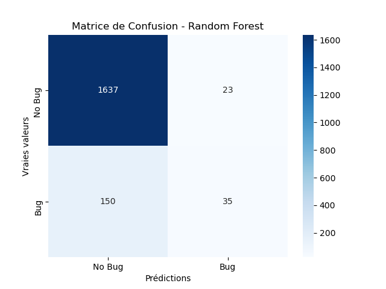
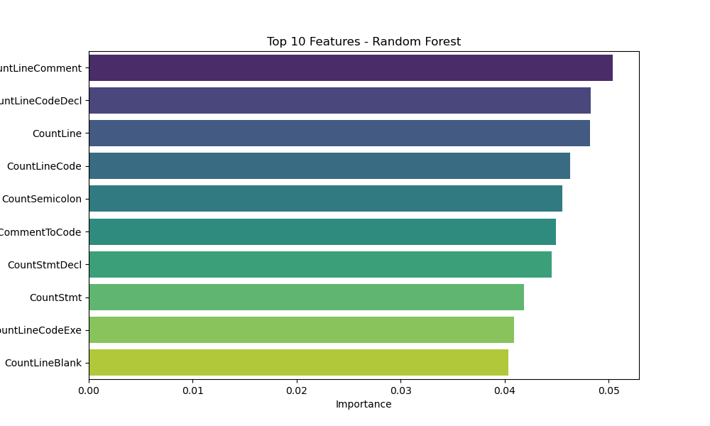
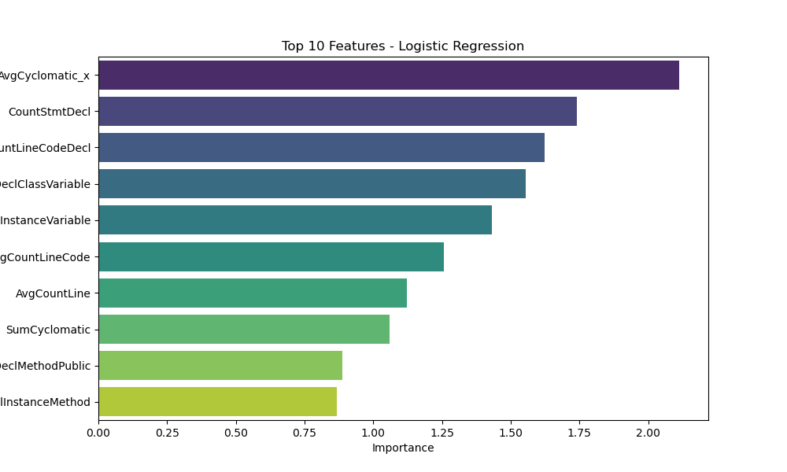

# Model Evaluation Results

## Metrics
| Model               |      AUC |   Precision |   Recall |
|:--------------------|---------:|------------:|---------:|
| Logistic Regression | 0.730608 |    0.573986 | 0.10441  |
| Random Forest       | 0.793778 |    0.561602 | 0.167248 |

## Visualizations
### Matrice de Confusion
|**Random Forest** | **Logistic Regression**|
:-----------------:|:-----------------------:
 | 

### Feature Importances
**Random Forest**
| Feature            |   Importance |
|:-------------------|-------------:|
| CountLineComment   |    0.0503993 |
| CountLineCodeDecl  |    0.0482892 |
| CountLine          |    0.0481743 |
| CountLineCode      |    0.0463296 |
| CountSemicolon     |    0.0455418 |
| RatioCommentToCode |    0.0449626 |
| CountStmtDecl      |    0.0444878 |
| CountStmt          |    0.0418535 |
| CountLineCodeExe   |    0.0408712 |
| CountLineBlank     |    0.0403461 |
---

**Logistic Regression**
| Feature                   |   Importance |
|:--------------------------|-------------:|
| AvgCyclomatic_x           |     2.11255  |
| CountStmtDecl             |     1.73897  |
| CountLineCodeDecl         |     1.62146  |
| CountDeclClassVariable    |     1.55368  |
| CountDeclInstanceVariable |     1.43016  |
| AvgCountLineCode          |     1.25626  |
| AvgCountLine              |     1.1213   |
| SumCyclomatic             |     1.06012  |
| CountDeclMethodPublic     |     0.886652 |
| CountDeclInstanceMethod   |     0.868381 |

|**Random Forest** | **Logistic Regression**|
:-----------------:|:-----------------------:
 | 
