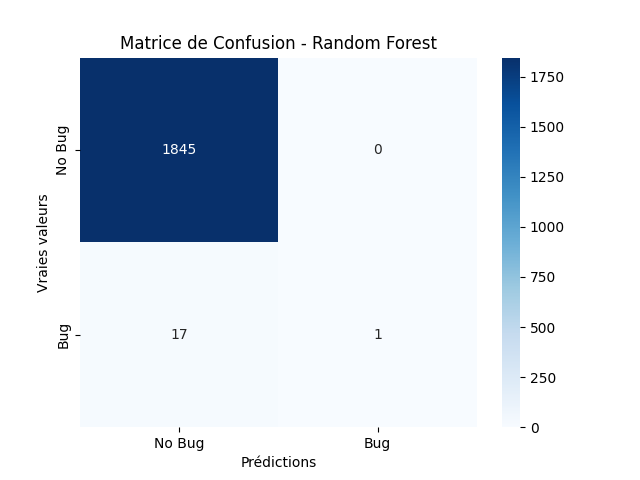
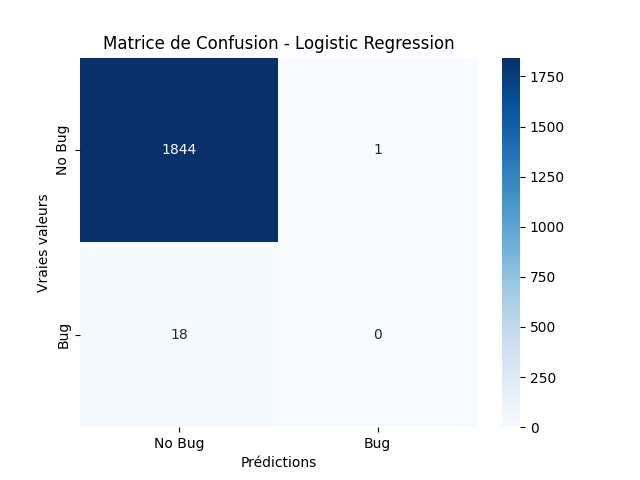
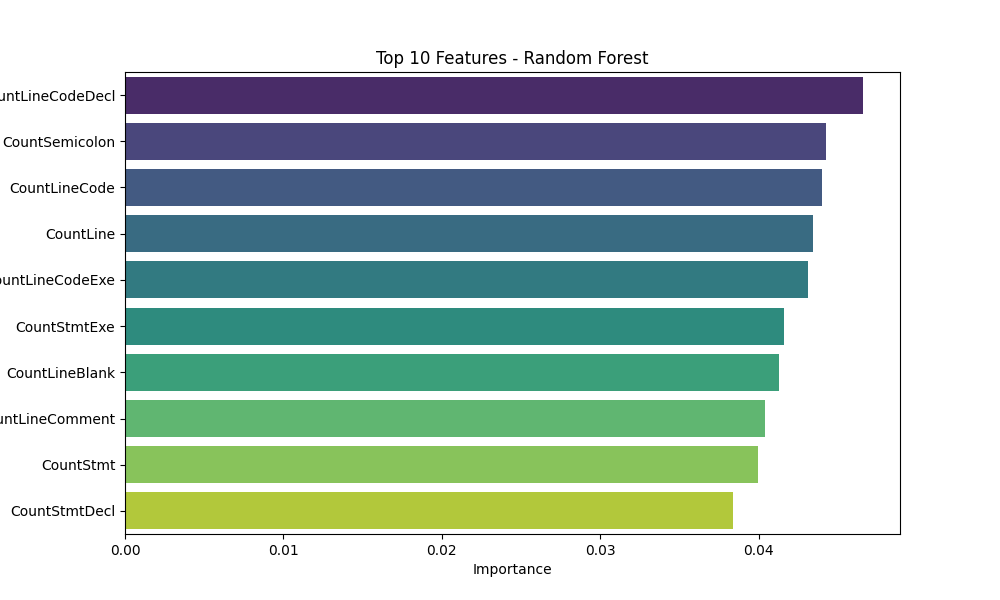
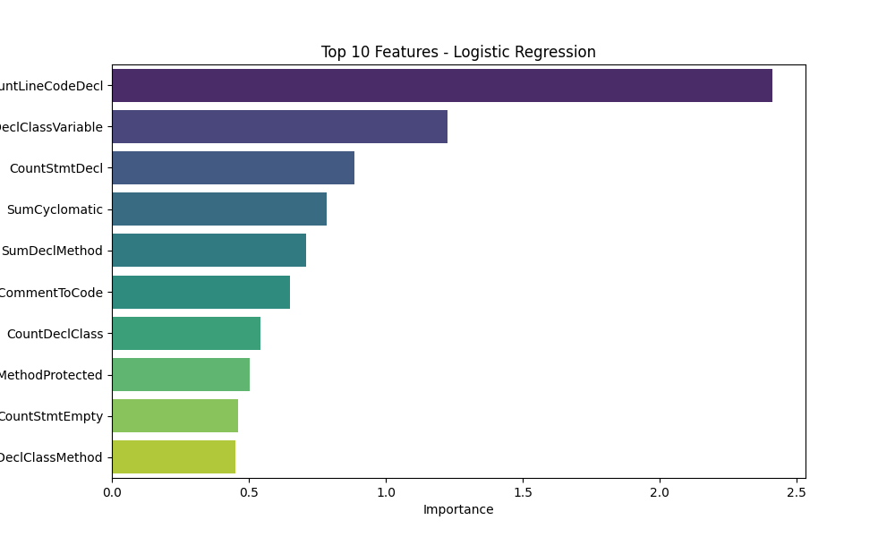

# Model Evaluation Results

## Metrics
| Model               |      AUC |   Precision |    Recall |
|:--------------------|---------:|------------:|----------:|
| Logistic Regression | 0.762035 |    0.258505 | 0.0582096 |
| Random Forest       | 0.703691 |    0.473595 | 0.0552103 |

## Visualizations
### Matrice de Confusion
|**Random Forest** | **Logistic Regression**|
:-----------------:|:-----------------------:
 | 

### Feature Importances
**Random Forest**
| Feature           |   Importance |
|:------------------|-------------:|
| CountLineCodeDecl |    0.0465773 |
| CountSemicolon    |    0.0442591 |
| CountLineCode     |    0.0440132 |
| CountLine         |    0.0434021 |
| CountLineCodeExe  |    0.0430871 |
| CountStmtExe      |    0.0415745 |
| CountLineBlank    |    0.0412557 |
| CountLineComment  |    0.0403701 |
| CountStmt         |    0.039961  |
| CountStmtDecl     |    0.0383602 |
---

**Logistic Regression**
| Feature                  |   Importance |
|:-------------------------|-------------:|
| CountLineCodeDecl        |     2.41209  |
| CountDeclClassVariable   |     1.22648  |
| CountStmtDecl            |     0.884604 |
| SumCyclomatic            |     0.783427 |
| SumDeclMethod            |     0.71012  |
| RatioCommentToCode       |     0.650154 |
| CountDeclClass           |     0.541294 |
| CountDeclMethodProtected |     0.504642 |
| CountStmtEmpty           |     0.462156 |
| CountDeclClassMethod     |     0.451466 |

|**Random Forest** | **Logistic Regression**|
:-----------------:|:-----------------------:
 | 
