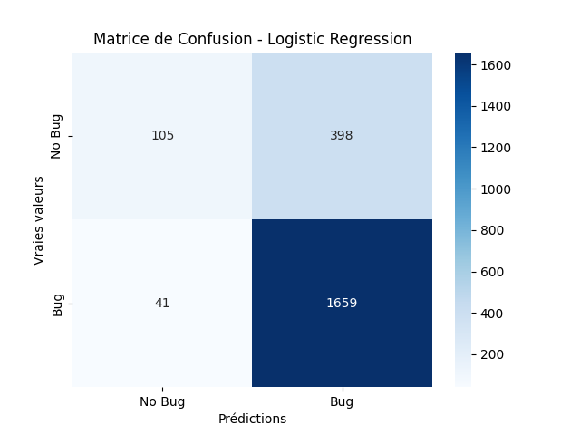
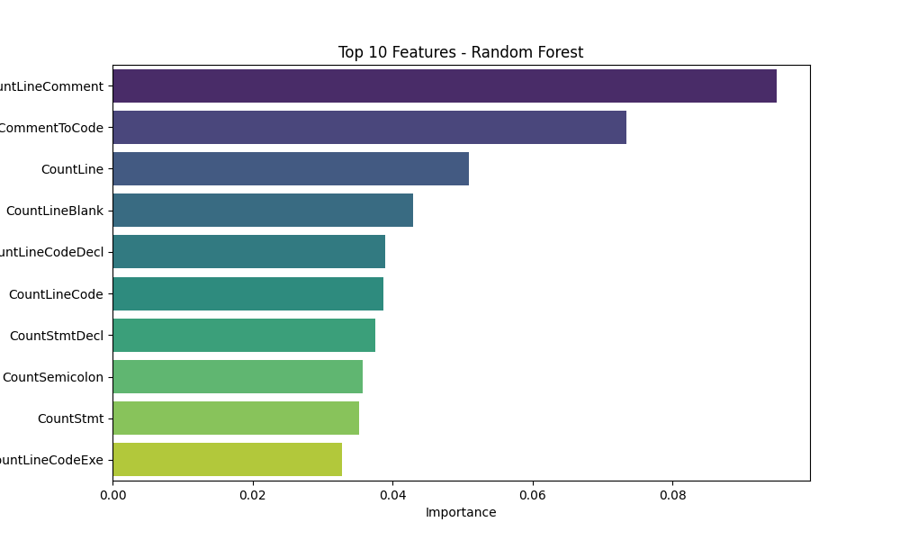
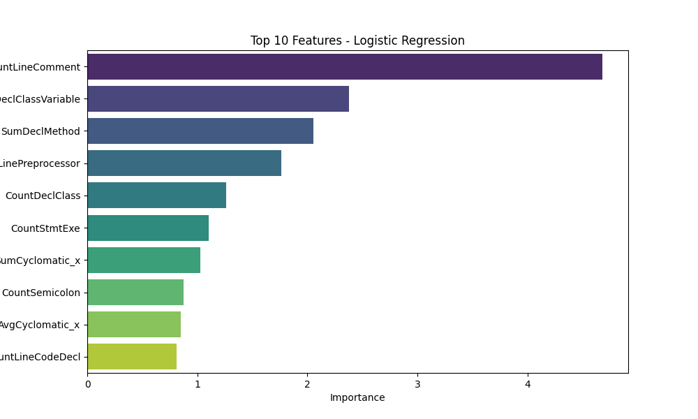

# Model Evaluation Results

## Metrics
| Model               |      AUC |   Precision |   Recall |
|:--------------------|---------:|------------:|---------:|
| Logistic Regression | 0.71207  |    0.788389 | 0.986075 |
| Random Forest       | 0.806596 |    0.849973 | 0.97426  |

## Visualizations
### Matrice de Confusion
|**Random Forest** | **Logistic Regression**|
:-----------------:|:-----------------------:
 | 

### Feature Importances
**Random Forest**
| Feature            |   Importance |
|:-------------------|-------------:|
| CountLineComment   |    0.0949278 |
| RatioCommentToCode |    0.0734006 |
| CountLine          |    0.0509039 |
| CountLineBlank     |    0.0429884 |
| CountLineCodeDecl  |    0.0389253 |
| CountLineCode      |    0.0386906 |
| CountStmtDecl      |    0.0375441 |
| CountSemicolon     |    0.0357181 |
| CountStmt          |    0.0352063 |
| CountLineCodeExe   |    0.0328289 |
---

**Logistic Regression**
| Feature                |   Importance |
|:-----------------------|-------------:|
| CountLineComment       |     4.67957  |
| CountDeclClassVariable |     2.38043  |
| SumDeclMethod          |     2.05295  |
| CountLinePreprocessor  |     1.76233  |
| CountDeclClass         |     1.26348  |
| CountStmtExe           |     1.10182  |
| SumCyclomatic_x        |     1.02817  |
| CountSemicolon         |     0.877424 |
| AvgCyclomatic_x        |     0.849288 |
| CountLineCodeDecl      |     0.813385 |

|**Random Forest** | **Logistic Regression**|
:-----------------:|:-----------------------:
 | 
