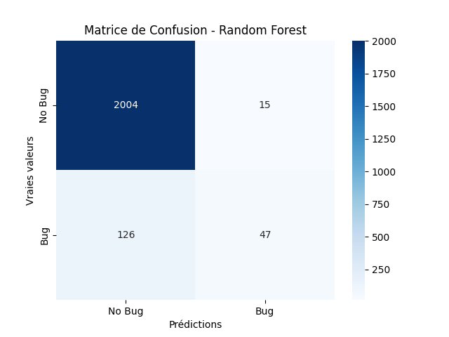
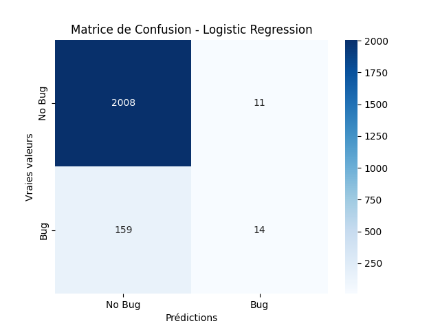
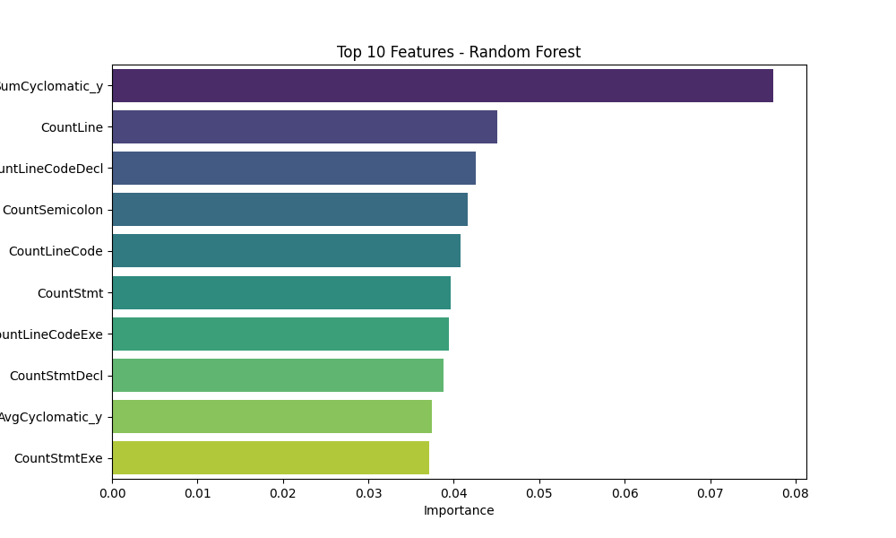
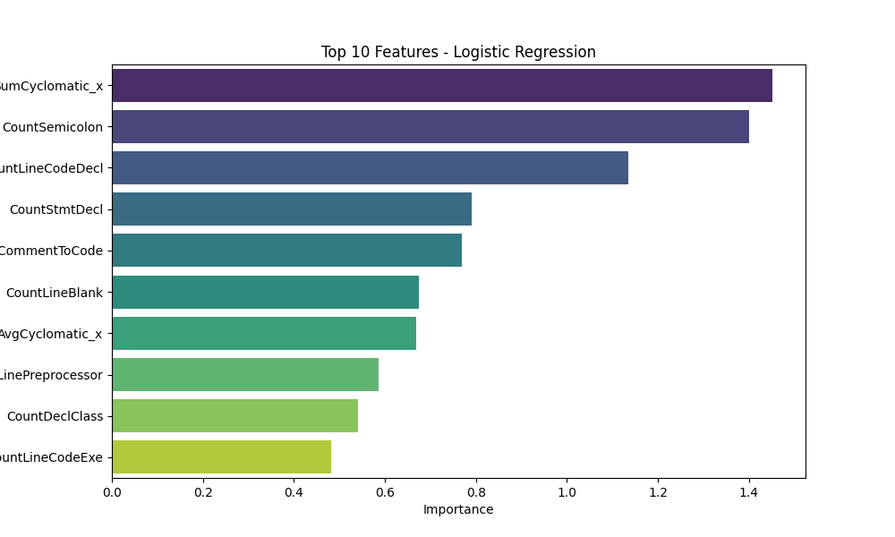

# Model Evaluation Results

## Metrics
| Model               |      AUC |   Precision |    Recall |
|:--------------------|---------:|------------:|----------:|
| Logistic Regression | 0.739849 |    0.562352 | 0.0798364 |
| Random Forest       | 0.824137 |    0.762959 | 0.239553  |

## Visualizations
### Matrice de Confusion
|**Random Forest** | **Logistic Regression**|
:-----------------:|:-----------------------:
 | 

### Feature Importances
**Random Forest**
| Feature           |   Importance |
|:------------------|-------------:|
| SumCyclomatic_y   |    0.0773929 |
| CountLine         |    0.0450742 |
| CountLineCodeDecl |    0.0426064 |
| CountSemicolon    |    0.0415918 |
| CountLineCode     |    0.0407471 |
| CountStmt         |    0.0396855 |
| CountLineCodeExe  |    0.0394064 |
| CountStmtDecl     |    0.0387532 |
| AvgCyclomatic_y   |    0.0374663 |
| CountStmtExe      |    0.0370886 |
---

**Logistic Regression**
| Feature               |   Importance |
|:----------------------|-------------:|
| SumCyclomatic_x       |     1.45181  |
| CountSemicolon        |     1.40109  |
| CountLineCodeDecl     |     1.13478  |
| CountStmtDecl         |     0.790779 |
| RatioCommentToCode    |     0.769943 |
| CountLineBlank        |     0.675401 |
| AvgCyclomatic_x       |     0.668714 |
| CountLinePreprocessor |     0.586127 |
| CountDeclClass        |     0.541757 |
| CountLineCodeExe      |     0.481647 |

|**Random Forest** | **Logistic Regression**|
:-----------------:|:-----------------------:
 | 
